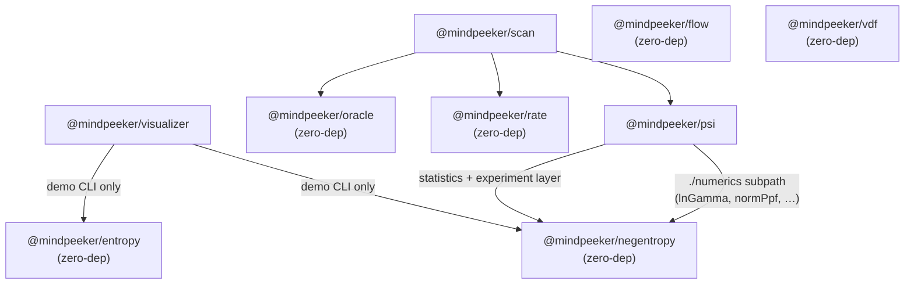

# mindpeeker-sdk

A Bun + TypeScript workspace of zero-dependency ESM packages that bridges two worlds that
rarely share a codebase: **rigorous randomness engineering** — NIST SP 800-90B health testing,
min-entropy accounting, extractors, verifiable delay functions — and the **statistical
machinery of frontier consciousness research** — GCP-style network statistics, PEAR-style
protocols, archetypal and radionic encodings. The bridge is honest by construction: every
package separates verifiable mathematics (exact null distributions, reproducible encodings,
deterministic replay, typed errors) from the contested hypotheses those tools can be used to
investigate. The math is asserted; the metaphysics is not.

## Packages

| Package | One-liner | Deps |
|---|---|---|
| [`@mindpeeker/entropy`](packages/entropy) | Provider-pluggable QRNG/TRNG/beacon randomness (30 backends) with continuous SP 800-90B health tests, conditioning, and fallback/xorMix/race strategies | — |
| [`@mindpeeker/negentropy`](packages/negentropy) | Order detection (GCP-style network statistics, negentropy estimators, pre-registered experiments) and randomness extraction; shared numerics via the `./numerics` subpath | — |
| [`@mindpeeker/flow`](packages/flow) | Transfer entropy and directed information flow for discrete symbol streams, with surrogate significance testing and streaming windows | — |
| [`@mindpeeker/psi`](packages/psi) | Mind-matter-interaction experiment protocols: PEAR-style tripolar runs, GCP formal event analysis, JSONL recording/replay, surrogate nulls, Bayes factors | `negentropy` (incl. `./numerics`) |
| [`@mindpeeker/rate`](packages/rate) | Malcolm Rae base-44 radionic angular encoding: rate parsing, card geometry + SVG, directional statistics, deterministic stream modulation | — |
| [`@mindpeeker/oracle`](packages/oracle) | Bias-free mapping from entropy streams to archetypal systems (I-Ching, Tarot, Elder Futhark runes, geomancy) with exact probabilities and entropy accounting | — |
| [`@mindpeeker/vdf`](packages/vdf) | Pietrzak verifiable delay function over RSA-2048: sequential-squaring time-locks, O(log T) proofs, beacon freshness seals | — |
| [`@mindpeeker/scan`](packages/scan) | Honest radionic scanning + broadcasting: catalog resonance scan with a real chance-deviation null model, rate/signature stream modulation, and a pre-registered tripolar MMI protocol | `oracle`, `rate`, `psi` |
| [`@mindpeeker/visualizer`](packages/visualizer) | Bun-native WebSocket server + zero-dependency WebGL2 dashboard for live byte streams, statistic series, matrices, and rate cards | `entropy`, `negentropy` (demo CLI) |

## Dependency graph

Most packages are zero-dependency; the three that aren't (`psi`, `scan`, `visualizer`) point only
at workspace siblings. Everything interoperates *structurally*: live sources are anything shaped
like `{ name, stream(opts?): AsyncIterable<Uint8Array> }`, so one entropy provider plugs into
flow, psi, rate, oracle, scan, and the visualizer without a single shared import. `@mindpeeker/scan`
is the one application-level composite — it orchestrates the primitives into radionic scan/broadcast.



Shared conventions across the workspace: ESM only, bits are MSB-first, batch inputs are
`Uint8Array`/`ArrayLike<number>`, async generators honor `AbortSignal`, every package throws
its own typed error class with a stable `code` union, and deterministic inputs always produce
deterministic outputs. All packages except the visualizer's server are browser-safe (enforced
by tests); the visualizer server is deliberately Bun-only.

## Quick start

```sh
bun install       # install workspace dependencies
bun run build     # build all packages (tsc; visualizer also bundles its client)
bun test          # run all tests
bun run check     # biome lint/format check + typecheck
```

Try the live dashboard after building. It defaults to the software CSPRNG but can visualize
any entropy source — including live hardware — via `--source`:

```sh
bun packages/visualizer/dist/cli.js                  # crypto noise → open the printed URL
bun packages/visualizer/dist/cli.js --list-sources   # crypto, jitter, esp32/serial, camera, mic, hwrng
bun packages/visualizer/dist/cli.js --source esp32   # an ESP32 TRNG over USB serial
bun packages/visualizer/dist/cli.js --source camera  # webcam sensor noise (needs ffmpeg)
```

## Research background

The scientific and historical context for the whole stack — entropy physics and SP 800-90B,
negentropy and GCP statistics, transfer entropy, the PEAR/GCP replication debate, radionics
history, exact divination probability models, VDF trust assumptions, and what would actually
constitute evidence — is written up in [`docs/research.md`](docs/research.md). Each package
README covers its own API in depth.

## License

MIT — see [`LICENSE`](LICENSE). Every package is published under MIT.
