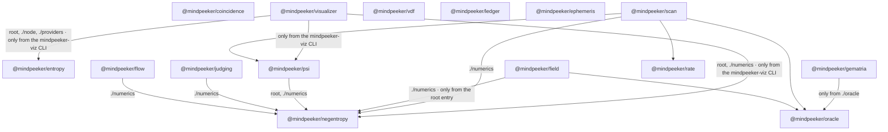

# mindpeeker-sdk

A Bun + TypeScript workspace of ESM packages with no third-party runtime dependencies. It
joins two kinds of work that rarely share a codebase: **randomness engineering** (NIST
SP 800-90B health tests, min-entropy accounting, extractors, verifiable delay functions)
and the **statistics of consciousness research** (GCP-style network statistics, PEAR-style
protocols, radionic and symbolic encodings). Around that core sit four supporting layers:
an **integrity** layer (`ledger`: hash chains, Merkle proofs and time brackets for
registrations and recordings), a **human-scoring** layer (`judging`: exact nulls for
forced-choice and free-response judging), a **coincidence** layer (`coincidence`: what an
apparent coincidence is worth) and an **ephemeris** layer (`ephemeris`: time and sky
coordinates for time-of-day, sidereal and lunar hypotheses).

Every package keeps the mathematics it can verify (exact null distributions, reproducible
encodings, deterministic replay, typed errors) apart from the contested hypotheses the tools
can be used to test. The math is asserted; the hypotheses are not. A significant statistic
says a source or a design departed from its null; it says nothing about why.

## Packages

The table and the graph below are generated by `bun run readme:table` from each
`package.json` and the package sources (dependency subpaths and the numbers in the
summaries are read from code). `bun run check` fails when they are stale.

<!-- BEGIN generated:package-table (bun run readme:table) -->
| Layer | Package | What it does | Workspace dependencies |
|---|---|---|---|
| Randomness sources | [`@mindpeeker/entropy`](packages/entropy) | Randomness from 30 backends (cloud QRNGs, public beacons, local hardware and a seeded HMAC_DRBG control) behind one interface, with SP 800-90B health tests, conditioning, beacon round metadata and fallback/xorMix/race strategies. | — |
| Statistics | [`@mindpeeker/negentropy`](packages/negentropy) | GCP-style network statistics, anytime-valid test martingales, pre-registered experiment sessions with versioned registration digests, and randomness extraction; exact shared numerics in `./numerics`. | — |
|  | [`@mindpeeker/flow`](packages/flow) | Transfer entropy and information dynamics for discrete symbol streams: conditional and collective TE, active information storage, a χ² test with an adequacy guard, surrogate families and streaming windows. | `negentropy` (`./numerics`) |
|  | [`@mindpeeker/coincidence`](packages/coincidence) | Exact coincidence probabilities: birthday-problem generalisations (non-uniform, k-fold, near and multi-attribute matches), Fisher's 1924 match scores and an exact clustering test for event series. | — |
|  | [`@mindpeeker/judging`](packages/judging) | Exact scoring and null distributions for forced-choice and free-response designs: binomial and Bayes-factor scoring, closed-deck and feedback baselines, rank statistics, displacement variance and optional-stopping risk. | `negentropy` (`./numerics`) |
| Experiment protocols | [`@mindpeeker/psi`](packages/psi) | Mind–matter-interaction protocols with valid nulls: tripolar runs with committed schedules and a control arm, GCP event analysis and a basket-file reader, seeded permutation surrogates, Bayes factors and e-processes, and hash-chained JSONL recording. | `negentropy` (root, `./numerics`) |
|  | [`@mindpeeker/field`](packages/field) | Point fields drawn from an entropy stream and tested against complete spatial randomness: calibrated attractor/void p-values, edge-corrected Ripley's K with global envelopes, quadrat, KDE and scan statistics, plus `./geo` samplers and geohash. | `negentropy` (`./numerics`; only from the root entry)<br>`oracle` |
|  | [`@mindpeeker/scan`](packages/scan) | Radionic scanning and broadcasting rebuilt on the other packages: AetherOne-parity race and General Vitality with exact null tails, a per-item binomial deviation null with multiplicity control, and pre-registered tripolar scans. | `negentropy` (`./numerics`)<br>`oracle`<br>`psi`<br>`rate` |
| Symbolic encodings | [`@mindpeeker/oracle`](packages/oracle) | Bias-free casts for 10 divination systems (11 cast functions: I Ching, Tarot, runes, geomancy, Ifá and others) with exact rational probabilities, rejection sampling and entropy accounting. | — |
|  | [`@mindpeeker/gematria`](packages/gematria) | 43 exact-integer ciphers across 10 scripts, temurah and Aiq Beker tools, collision statistics for equal-value matches, a 191-entry public-domain lexicon (`./lexicon`) and an entropy-to-word bridge (`./oracle`). | `oracle` (only from `./oracle`) |
|  | [`@mindpeeker/rate`](packages/rate) | Malcolm Rae's base-44 radionic rates as exact geometry: parsing, digit-to-angle maps, directional statistics, card SVG and deterministic, reversible stream modulation. | — |
| Integrity and time | [`@mindpeeker/vdf`](packages/vdf) | Verifiable delay functions in the signed quadratic residues of an RSA group: sequential squaring with Pietrzak and Wesolowski proofs, modulus sanity checks and versioned beacon seals. | — |
|  | [`@mindpeeker/ledger`](packages/ledger) | Tamper-evident records with WebCrypto only: RFC 8785 canonical JSON, hash-chained JSONL, RFC 6962 Merkle proofs, signed-note checkpoints, commit–reveal, registration records and beacon/VDF time brackets. | — |
|  | [`@mindpeeker/ephemeris`](packages/ephemeris) | Exact time and sky coordinates for testing time-of-day, sidereal and lunar hypotheses: Julian day, ΔT, sidereal time, Meeus Sun and Moon, moon phases and Spottiswoode's LST window scan with a seeded permutation null. | — |
| Display | [`@mindpeeker/visualizer`](packages/visualizer) | Bun WebSocket server and zero-dependency WebGL2 dashboard for live byte streams, statistic series with pointwise and anytime-valid bands, matrices and rate cards, with hash-chained record and replay. | `entropy` (root, `./node`, `./providers`; only from the `mindpeeker-viz` CLI)<br>`negentropy` (root, `./numerics`; only from the `mindpeeker-viz` CLI)<br>`psi` (only from the `mindpeeker-viz` CLI) |
<!-- END generated:package-table -->

## Dependency graph

No package depends on third-party code at runtime; every arrow is a workspace dependency,
labelled with the subpaths it uses and, where it applies, the only entry point that needs it.
Everything else interoperates *structurally*: a live source is anything shaped like
`{ name, stream(opts?): AsyncIterable<Uint8Array> }`, so one entropy provider plugs into flow,
psi, rate, oracle, field, scan, gematria's oracle bridge and the visualizer without a shared
import.

<!-- BEGIN generated:dependency-graph (bun run readme:table) -->

```mermaid
graph TD
  pkg_entropy["@mindpeeker/entropy"]
  pkg_negentropy["@mindpeeker/negentropy"]
  pkg_flow["@mindpeeker/flow"]
  pkg_coincidence["@mindpeeker/coincidence"]
  pkg_judging["@mindpeeker/judging"]
  pkg_psi["@mindpeeker/psi"]
  pkg_field["@mindpeeker/field"]
  pkg_scan["@mindpeeker/scan"]
  pkg_oracle["@mindpeeker/oracle"]
  pkg_gematria["@mindpeeker/gematria"]
  pkg_rate["@mindpeeker/rate"]
  pkg_vdf["@mindpeeker/vdf"]
  pkg_ledger["@mindpeeker/ledger"]
  pkg_ephemeris["@mindpeeker/ephemeris"]
  pkg_visualizer["@mindpeeker/visualizer"]
  pkg_flow -- "./numerics" --> pkg_negentropy
  pkg_judging -- "./numerics" --> pkg_negentropy
  pkg_psi -- "root, ./numerics" --> pkg_negentropy
  pkg_field -- "./numerics · only from the root entry" --> pkg_negentropy
  pkg_field --> pkg_oracle
  pkg_scan -- "./numerics" --> pkg_negentropy
  pkg_scan --> pkg_oracle
  pkg_scan --> pkg_psi
  pkg_scan --> pkg_rate
  pkg_gematria -- "only from ./oracle" --> pkg_oracle
  pkg_visualizer -- "root, ./node, ./providers · only from the mindpeeker-viz CLI" --> pkg_entropy
  pkg_visualizer -- "root, ./numerics · only from the mindpeeker-viz CLI" --> pkg_negentropy
  pkg_visualizer -- "only from the mindpeeker-viz CLI" --> pkg_psi
```
<!-- END generated:dependency-graph -->

Shared conventions across the workspace: ESM only, bits are MSB-first, batch inputs are
`Uint8Array`/`ArrayLike<number>`, async generators honour `AbortSignal`, every package throws
its own typed error class with a stable `code` union, and deterministic inputs always produce
deterministic outputs. All packages except the visualizer's server are browser-safe (enforced
by tests); the visualizer server is deliberately Bun-only.

### Shared conventions

**Byte sources and abort.** A live source is anything shaped like
`{ name: string, stream(opts?: { signal?: AbortSignal, chunkBytes?: number }): AsyncIterable<Uint8Array> }`.
`chunkBytes` is a hint a source may ignore; consumers must accept chunks of any length. When
`signal` fires, a source may either **throw** (entropy providers throw
`EntropyError('aborted')`) or simply **return** (end the iteration). Both are valid, so every
consumer handles both: it checks `signal.aborted` when a stream ends and reports the abort as
its own `aborted` error, never as "not enough data". **Whoever opens an iterator or reader closes
it** (`iterator.return()` / `reader.close()` in a `finally`), so a finished or failed call never
leaks a socket, serial port, camera track or child process; a reader you pass in stays open and
remains yours to close.

**Errors.** Each package throws exactly one error class of its own (`EntropyError`,
`NegentropyError`, `FlowError`, `PsiError`, `OracleError`, `LedgerError`, …) with `name` set to
the class name, a stable machine-readable `code` from an exported string-literal union
(`FlowErrorCode`, …), and the underlying failure (a sibling package's error, a `DOMException`,
a `RangeError`) attached as `cause`. Match on `code`, never on `message`. Caller mistakes are
rejected at the public boundary before any entropy or I/O is spent.

**Option names.** The same concept uses the same name in every package: `windowSize` /
`hopSize` for sliding windows (in samples, trials or steps), `timeoutMs` for durations in
milliseconds, `signal` for an `AbortSignal`, and `seed` for anything that makes a randomized
procedure (surrogates, permutations, dithering) reproducible.

The reasoning behind these rules is recorded in [`docs/decisions/`](docs/decisions/).

## Quick start

On a fresh clone, build before running the checks: the typecheck resolves sibling packages
through their built `dist` types.

```sh
bun install       # install workspace dependencies (Bun 1.3.1)
bun run build     # build every package in dependency order
bun run check     # biome, typecheck, README import checker, README table check
bun test          # run all tests
```

[`docs/cookbook.md`](docs/cookbook.md) walks through recipes that combine several packages;
runnable versions live in the private [`examples/`](examples/) workspace.

Try the live dashboard after building. It defaults to the software CSPRNG but can show any
entropy source, including live hardware, via `--source` (see
[`docs/devices.md`](docs/devices.md) for supported devices):

```sh
bun packages/visualizer/dist/cli.js                  # crypto noise → open the printed URL
bun packages/visualizer/dist/cli.js --list-sources   # crypto, jitter, esp32/serial, camera, mic, hwrng
bun packages/visualizer/dist/cli.js --source esp32   # an ESP32 TRNG over USB serial
bun packages/visualizer/dist/cli.js --source camera  # webcam sensor noise (needs ffmpeg)
```

## Documentation

| Document | What it covers |
|---|---|
| [`docs/research.md`](docs/research.md) | Scientific and historical background: entropy physics and SP 800-90B, negentropy and GCP statistics, transfer entropy, the PEAR/GCP debate, radionics, divination probability models, VDF trust assumptions, and what would count as evidence |
| [`docs/cookbook.md`](docs/cookbook.md) | Cross-package recipes with real API calls |
| [`docs/devices.md`](docs/devices.md) | Hardware compatibility: serial TRNG boards, USB RNGs, SDR, cameras and microphones, browser transport support |
| [`docs/data-sources.md`](docs/data-sources.md) | Public data feeds: GCP basket files, geomagnetic indices, randomness beacons |
| [`docs/data-licenses.md`](docs/data-licenses.md) | Every bundled dataset and test vector with its licence basis |
| [`docs/decisions/`](docs/decisions/) | Architecture decision records for the cross-cutting rules |
| [`docs/releasing.md`](docs/releasing.md) | Release checklist and publish order |

Each package README is the reference for its own API and lists its behaviour changes per
release.

## Contributing and security

Read [`CONTRIBUTING.md`](CONTRIBUTING.md) for the development setup, repository conventions,
fixtures and the changeset workflow. Report vulnerabilities privately as described in
[`SECURITY.md`](SECURITY.md). Participation follows the
[`CODE_OF_CONDUCT.md`](CODE_OF_CONDUCT.md).

## License

MIT, see [`LICENSE`](LICENSE). Every package ships its own copy of the MIT licence. Bundled
data and test vectors are listed with their licence basis in
[`docs/data-licenses.md`](docs/data-licenses.md).
